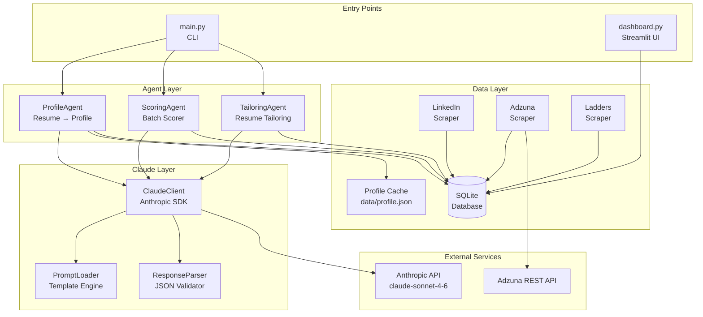
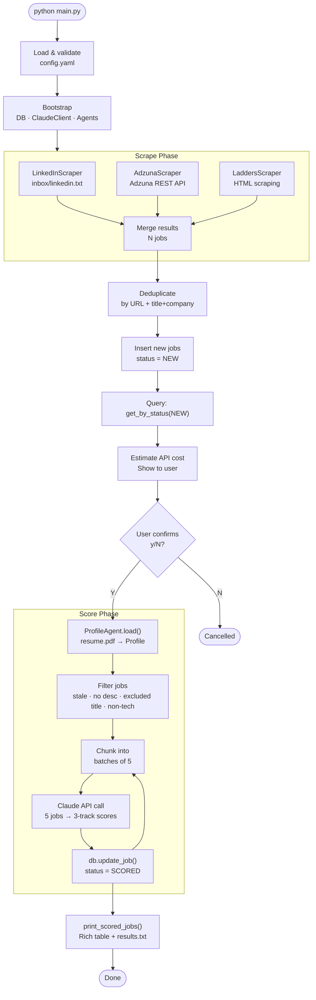
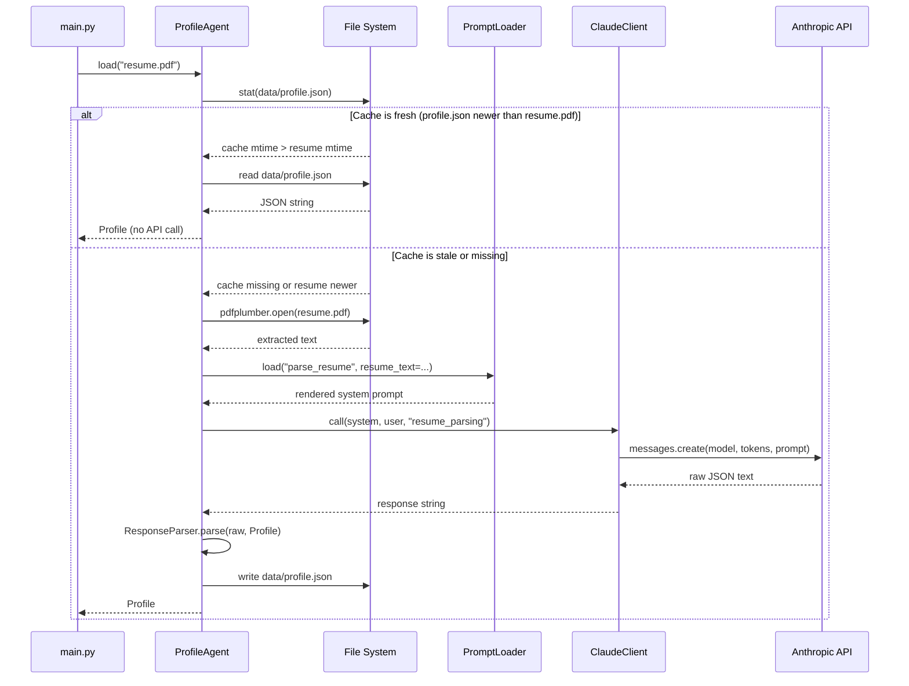
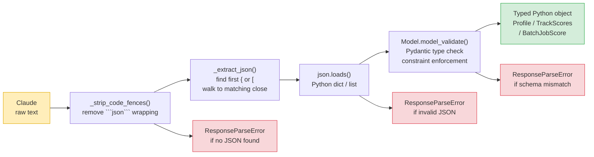
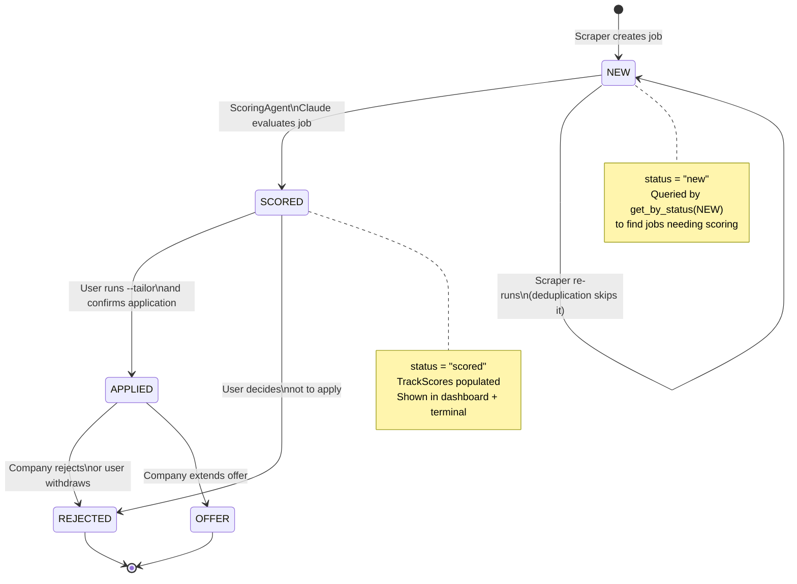
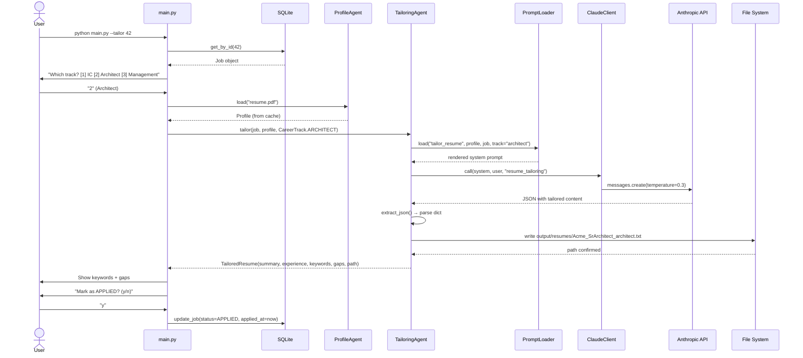
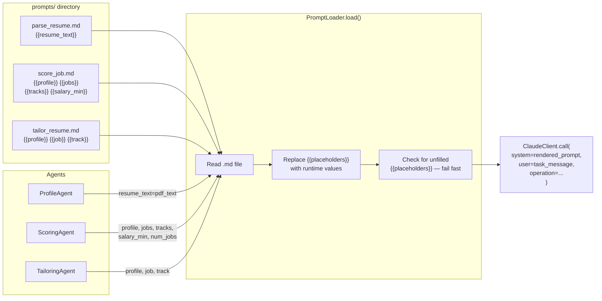
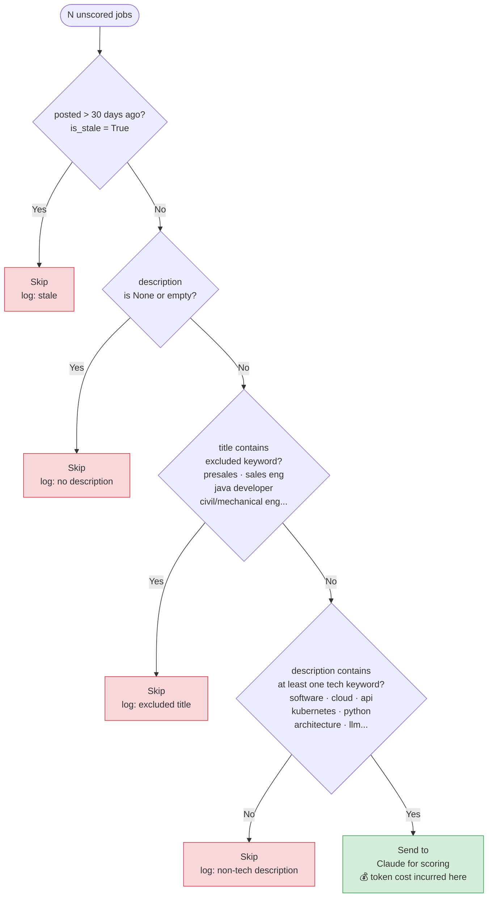
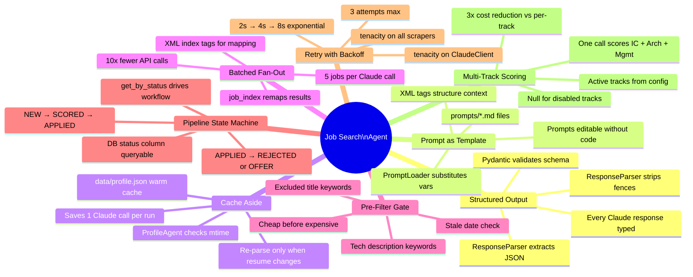

# Architecture Diagrams

All diagrams are written in [Mermaid](https://mermaid.js.org/) and render automatically on GitHub.

---

## 1. System Architecture — Component Overview

High-level block diagram showing the four layers and how components relate.



---

## 2. Main Run — Control Flow

End-to-end flow for `python main.py` (the default scrape + score command).



---

## 3. Agentic Pattern: Cache-Aside (ProfileAgent)

Shows how the ProfileAgent avoids redundant Claude calls using a file-based cache.



---

## 4. Agentic Pattern: Batched Fan-Out (ScoringAgent)

Shows how 5 jobs are packed into one Claude call, scored simultaneously across all tracks, and mapped back by index.

```mermaid
sequenceDiagram
    participant SA as ScoringAgent
    participant PL as PromptLoader
    participant CC as ClaudeClient
    participant API as Anthropic API
    participant RP as ResponseParser
    participant DB as SQLite

    Note over SA: 50 jobs → 10 batches of 5

    loop Each batch of 5 jobs
        SA->>SA: Filter: stale? no desc?\nexcluded title? non-tech?

        Note over SA: Build XML jobs block
        SA->>SA: &lt;job index="0"&gt;...&lt;/job&gt;<br/>&lt;job index="1"&gt;...&lt;/job&gt;<br/>...&lt;job index="4"&gt;...&lt;/job&gt;

        SA->>PL: load("score_job", profile, jobs, tracks, salary_min)
        PL-->>SA: rendered system prompt

        SA->>CC: call(system, "Score these 5 jobs", "job_scoring")
        CC->>API: messages.create(claude-sonnet-4-6)
        API-->>CC: JSON array [0..4]
        CC-->>SA: raw response string

        SA->>RP: parse_list(raw, BatchJobScore)
        RP->>RP: strip_code_fences()<br/>extract_json()<br/>json.loads()<br/>model_validate() ×5
        RP-->>SA: list[BatchJobScore]

        Note over SA: Map scores back by job_index
        SA->>SA: score_map = {item.job_index: item}

        loop Each job in batch
            SA->>SA: job.scores = TrackScores(ic, architect, management)
            SA->>SA: job.status = SCORED
            SA->>DB: update_job(job)
        end
    end
```

---

## 5. Agentic Pattern: Structured Output Pipeline

How raw Claude text becomes a validated, typed Python object at every agent boundary.



---

## 6. Job Lifecycle — Pipeline State Machine

Every job moves through a defined set of states. Status transitions are explicit and stored in the database.



---

## 7. Resume Tailoring — Sequence Diagram

Flow for `python main.py --tailor 42`.



---

## 8. Prompt-as-Template Pattern

How a prompt file flows from disk to the Claude API.



---

## 9. Pre-Filter Gate Pattern

Two-stage filtering that eliminates irrelevant jobs before Claude is called.



---

## 10. Agentic Patterns Summary

Where each pattern appears in the codebase.


