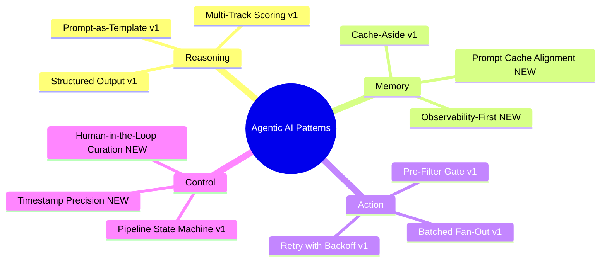
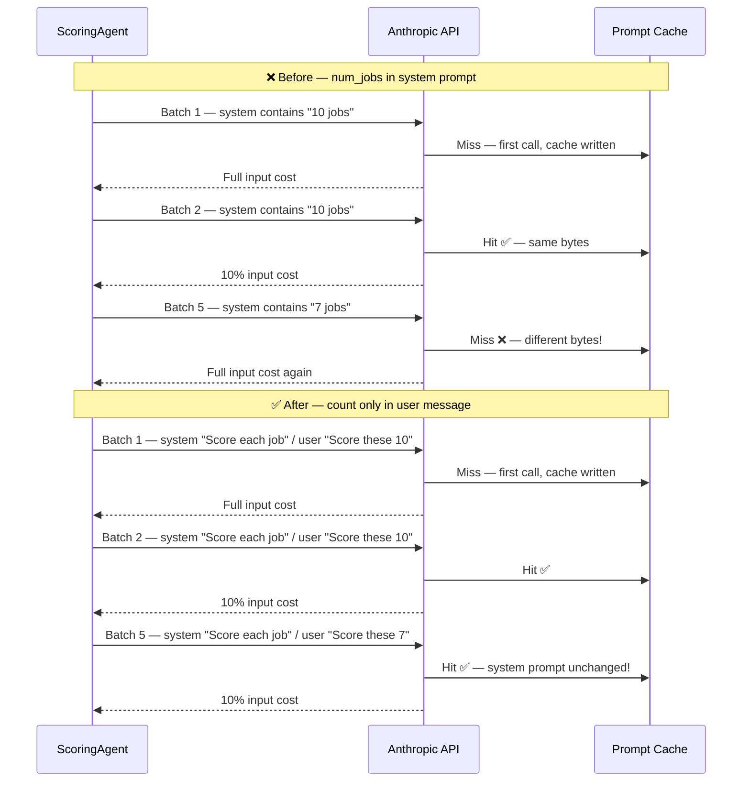
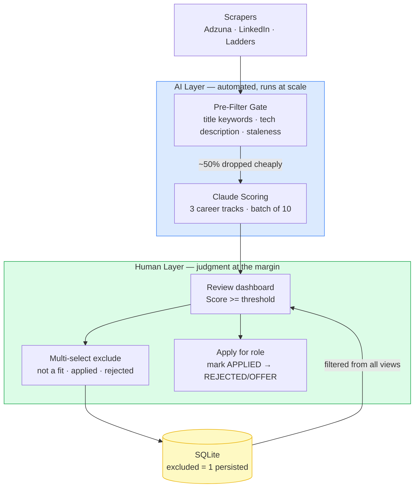
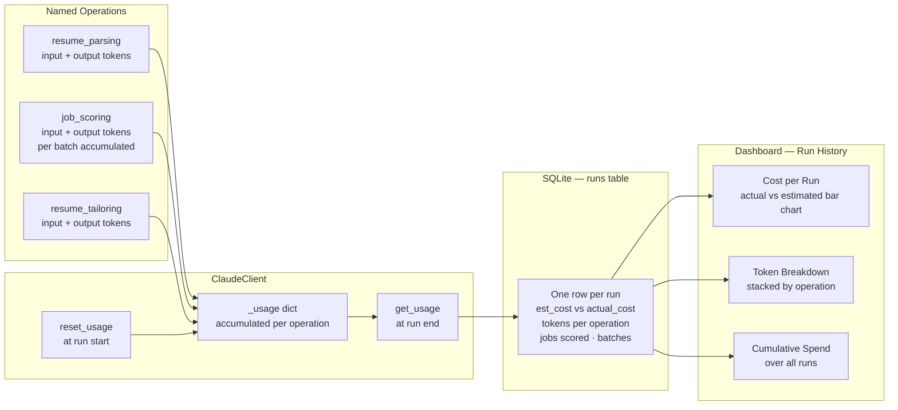
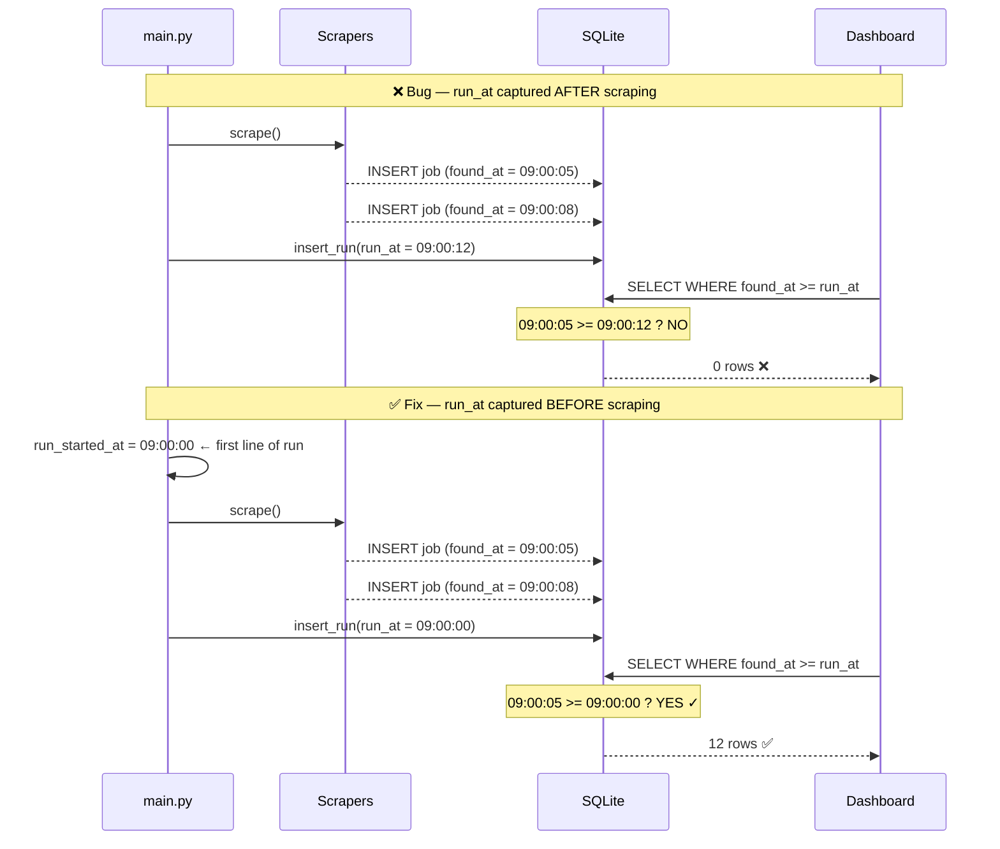
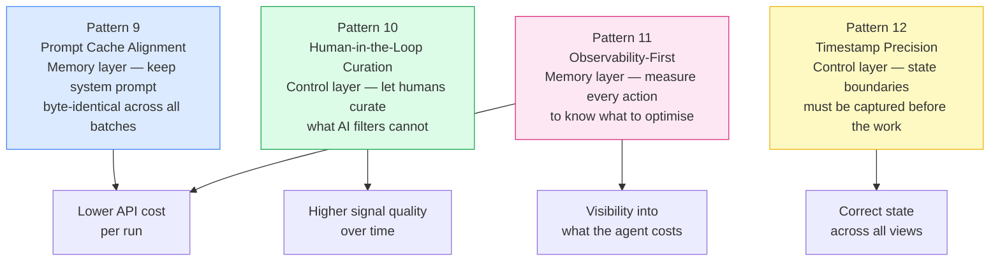

# LinkedIn Article Draft — Part 2

---

> **Publishing note:** Diagrams are in Mermaid format — export as PNG before posting to LinkedIn. Use mermaid.live → Download PNG. Use the same theme block from the v1 article for visual consistency.

> **Content disclosure:** Portions of this article were drafted and edited with the assistance of Claude (Anthropic). The project, the code, the architecture decisions, and the lessons learned are entirely my own — Claude helped me articulate them clearly.

---

## HEADLINE (options)

**Option A:** I ran my AI job search agent in production. Here are 4 things that broke and what I learned.

**Option B:** 4 production lessons from running an AI agent for real — the patterns your course didn't teach you.

**Option C:** Beyond the 8 patterns: what running an AI agent in production actually teaches you.

---

## TL;DR

- My first article covered 8 agentic AI patterns I used to build a job search agent
- This is the follow-up: what happened when I actually ran it, hit bugs, and evolved the system
- 4 new production lessons — each one maps to a deeper agentic AI pattern
- The theme: the difference between a prototype and a production agent is observability, precision, and knowing where humans belong in the loop

---

## OPENING HOOK

In my last article I shared 8 agentic AI patterns I used to build a job search agent. The response was encouraging — and several people asked: what happened next?

Here's what happened. I ran it. Real job postings. Real API bills. Real bugs.

Three things that looked fine in testing broke silently in production. One architectural decision I thought was obvious turned out to be wrong in a subtle way. And I added a capability I hadn't planned for — one that turned out to be the most practically useful thing in the system.

This article covers 4 production lessons that extended the original 8 patterns. Each one maps to a concept in agentic AI design that I didn't fully appreciate until I saw it go wrong.

---

## HOW THESE PATTERNS FIT INTO THE AGENTIC AI LANDSCAPE

Before the patterns: a quick map of where these fit.

The agentic AI pattern space can be roughly grouped into four layers:

| Layer | What it covers |
|---|---|
| **Reasoning** | How the agent thinks: chain-of-thought, structured output, multi-track scoring |
| **Memory** | What the agent remembers: cache-aside, context window management, prompt caching |
| **Action** | What the agent does: tool use, batched fan-out, retry with backoff |
| **Control** | Who controls the agent: human-in-the-loop, pipeline state machine, approval gates |

The 8 patterns from v1 covered all four layers. The 4 new patterns deepen the **Memory** and **Control** layers — the ones that matter most when you move from prototype to production.

---

## PATTERN 9: Prompt Cache Alignment

### What it is

Anthropic's API supports server-side **prompt caching**: mark your system prompt with `cache_control: {"type": "ephemeral"}` and the API caches the processed token embeddings for up to 5 minutes. Cached input tokens cost 10% of normal — a 90% reduction for repeated calls.

This is different from the Cache-Aside pattern in v1. Cache-Aside avoids calling the API entirely by storing the *output*. Prompt caching is about reducing the cost of the *input* processing when the API is called.

### The bug

My scoring agent batches up to 10 jobs per API call. With 50 unscored jobs, that's 5 batches. I expected the prompt cache to hit on batches 2–5 and only miss on batch 1.

But batch 5 (the last, partial batch with 7 jobs instead of 10) was always a cache miss. I was paying full input token price on the last batch of every run.

The root cause: my system prompt template contained `{{num_jobs}}`. The system prompt for the first four batches read *"Score each of the 10 job postings provided"* — identical bytes, cache hits. The last batch read *"Score each of the 7 job postings provided"* — different bytes, cache miss.

### The fix

Remove `{{num_jobs}}` from the system prompt template. Pass the count only in the user message, which is not cached. The system prompt is now byte-identical across every batch in a run.

### The agentic AI principle

**Cache keys are exact.** Any variable in a cached prompt that changes between calls destroys cache effectiveness for that call. The discipline is to put everything *stable* (instructions, schema, persona, examples) in the system prompt and everything *variable* (the actual data, counts, run-specific context) in the user message.

This is a specific instance of the broader **Context Window Management** pattern: deliberately partitioning your prompt into stable and variable sections so you can optimise each independently.

---

## PATTERN 10: Human-in-the-Loop Curation

### What it is

After scoring, the dashboard showed 120 jobs. The AI had pre-filtered aggressively, but a meaningful fraction were still noise — roles I'd already rejected, companies I'd applied to elsewhere, or postings that looked right on title but wrong on reading. Every subsequent run these jobs reappeared.

The instinct was to tune the filters — add more keywords, tighten the exclusion list. But that's the wrong instinct. Filters operate on patterns; human judgment operates on context. No keyword list can encode "I spoke to this recruiter last week and it's not a fit."

The right answer: let the human curate directly.

### How it works

I added multi-row selection to every dashboard table. Select one or more jobs, pick a reason (Not a good fit / Applied elsewhere / Rejected / Not interested), click Exclude. The jobs are flagged in the database and filtered out of every query permanently — they never reappear across runs.

### The agentic AI principle

This is the **Human-in-the-Loop** pattern — but the specific variant matters. There are three common HITL positions:

| Position | When the human acts | Tradeoff |
|---|---|---|
| **Approval gate** | Before every agent action | Safe but slow |
| **Exception handling** | When the agent is uncertain | Efficient but requires confidence scoring |
| **Curation loop** | After results are produced | Scales well; improves signal over time |

A job search agent doesn't need an approval gate — it's low-stakes. But curation is high value: each exclusion permanently improves the signal-to-noise ratio. The human does what humans are good at (contextual judgment), and the AI does what AI is good at (processing 50 postings cheaply before the human sees any of them).

---

## PATTERN 11: Observability-First Design

### What it is

The first version tracked estimated cost only. I knew roughly what each run would cost before it started — but I didn't know what it actually cost, which operations were most expensive, or how costs were trending over time.

Without that data, optimisation is guesswork. With it, you can see immediately when a change (like doubling BATCH_SIZE from 5 to 10) cuts costs, and by how much.

### How it works

Every API call goes through a central `ClaudeClient`. I added a `_usage` dict keyed by operation name (`"resume_parsing"`, `"job_scoring"`, `"resume_tailoring"`). The Anthropic SDK returns actual token counts in the response metadata — these accumulate during the run. At the end, the totals are persisted to a `runs` table alongside the estimated cost for comparison.

### What the data revealed

Two things showed up immediately:

1. **Doubling batch size from 5 to 10 cut scoring cost by ~45%** — not 50%, because larger batches slightly increase output tokens per call, but close. Without actual token data I would have estimated 50% and never known the difference.

2. **The last batch cache miss** (Pattern 9) showed up as a spike in `tokens_input_scoring` on the last batch of multi-batch runs. The data pointed directly at the bug.

### The agentic AI principle

**Observability is not optional in production agents.** Every agent action that calls an external API should be:
- Named (so costs are attributable by operation)
- Counted (tokens in, tokens out)
- Persisted (so you have a time-series, not just a snapshot)
- Displayed (so the human can act on the data)

This is the **Agent Monitoring** pattern. It sits alongside the Evaluator pattern in the agentic AI literature — the difference is that Evaluator judges output quality, while Agent Monitoring tracks resource consumption. Both are necessary in production.

---

## PATTERN 12: Timestamp Precision in Event-Sourced Pipelines

### What it is

The dashboard had a "New Jobs" view that was supposed to show every job found in the most recent run. After every run it showed zero jobs. The data was there — the query was wrong.

### The root cause

`insert_run()` was calling `datetime.utcnow()` internally — at the moment it was called, which was after all scraping and scoring had completed. Every job's `found_at` timestamp was earlier than the run's `run_at` timestamp, so `WHERE found_at >= run_at` returned nothing.

The fix: capture `run_started_at = datetime.utcnow()` as the very first line of the run, before any scraping, and pass it explicitly to `insert_run()`.

### The agentic AI principle

**In event-sourced pipelines, when you record state matters as much as what you record.**

This is a specific case of the **Pipeline State Machine** pattern from v1 — but it highlights a precision requirement that the pattern description doesn't make explicit. When your pipeline has multiple stages that each produce timestamped records, the anchor timestamp (the run start) must be captured before any records are produced, not after.

The general rule: **a run's start timestamp is a boundary, not a summary.** Record it before the work begins, not when the work ends.

This same principle applies anywhere an agent manages time-bounded state:
- A processing window that must capture all events within it
- A cache invalidation timestamp that must predate the data it protects
- A retry window that must start before the first attempt

---

## HOW THE 4 PATTERNS FIT TOGETHER

Individually, each pattern solves a specific problem. Together, they represent a more mature approach to production agent design:

---

## WHAT SURPRISED ME

Three things I didn't expect:

**1. The prompt cache bug was invisible without cost data.** The cache was hitting on most batches, so the system worked correctly — just slightly more expensively than it should have. Without per-batch token tracking I would never have found it. Observability and the cache bug are not independent patterns — one revealed the other.

**2. Human curation is underrated in the agentic AI literature.** Most writing about HITL focuses on approval gates — should the agent be allowed to take this action? But for information-processing agents, curation is more valuable: letting the human continuously improve the quality of the data the agent operates on. The exclusion feature took an afternoon to build and immediately became the most-used feature in the dashboard.

**3. Timestamp bugs are timestamp ordering bugs.** Every timestamp bug I've seen in production systems comes down to the same thing: code that assumes the order in which events are recorded matches the order in which they occurred. `run_at captured after scraping` is the same class of bug as `updated_at not updated on partial save` or `created_at set to now() at the ORM layer instead of the application layer`. The fix is always: record the boundary before you cross it.

---

## THE UPDATED PATTERN MAP — ALL 12

| # | Pattern | Layer | What it does |
|---|---|---|---|
| 1 | Structured Output | Reasoning | Enforce JSON + Pydantic at every agent boundary |
| 2 | Prompt-as-Template | Reasoning | Prompts as files — editable without touching code |
| 3 | Cache-Aside | Memory | Resume parsed once, cached, re-used across runs |
| 4 | Pre-Filter Gate | Action | Cheap filters before expensive LLM calls |
| 5 | Batched Fan-Out | Action | 10 jobs per Claude call — 10x fewer API calls |
| 6 | Pipeline State Machine | Control | Explicit job states with intentional transitions |
| 7 | Retry with Backoff | Action | Exponential backoff on transient API failures |
| 8 | Multi-Track Scoring | Reasoning | One call scores IC, Architect, and Management |
| **9** | **Prompt Cache Alignment** | **Memory** | **Byte-identical system prompt = cache hit every batch** |
| **10** | **Human-in-the-Loop Curation** | **Control** | **Human exclusion improves signal quality over time** |
| **11** | **Observability-First** | **Memory** | **Token + cost tracking per operation, persisted to DB** |
| **12** | **Timestamp Precision** | **Control** | **Run boundary captured before work begins, not after** |

---

## CLOSING

The first article was about patterns I knew I was using. This one is about patterns I discovered by running the system.

That distinction matters. Most agentic AI content is written before the author has run the thing in production. The patterns look clean in a diagram. They look different when you're looking at an API bill or debugging why a dashboard is always empty.

The 4 new patterns aren't exotic. None of them require a new framework or a new model. They require attention to the places where agentic systems are different from ordinary software: cost is a runtime variable, not a constant; human judgment belongs in the loop at specific points, not everywhere; and the order in which you record state is as important as the state itself.

v2 is running. More to come.

---

## CALL TO ACTION

Are you building something similar — a personal AI agent that solves a real problem you have? What patterns have you found that the courses didn't teach? Drop a comment or connect — I'd like to compare notes.

---

## HASHTAGS

#AgenticAI #AIEngineering #MachineLearning #SoftwareEngineering #Claude #Anthropic #JobSearch #CareerDevelopment #ProductionAI #LLM
